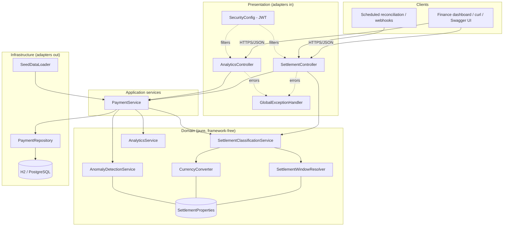
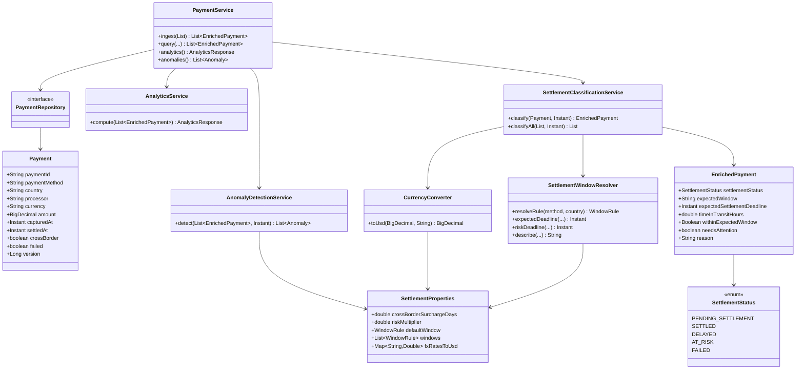
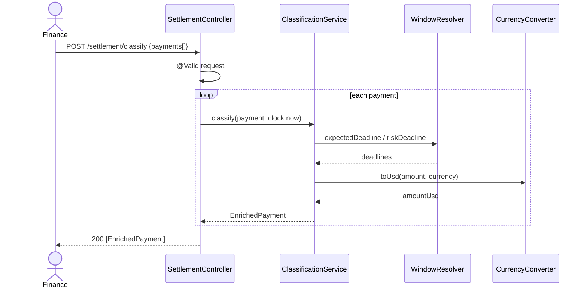
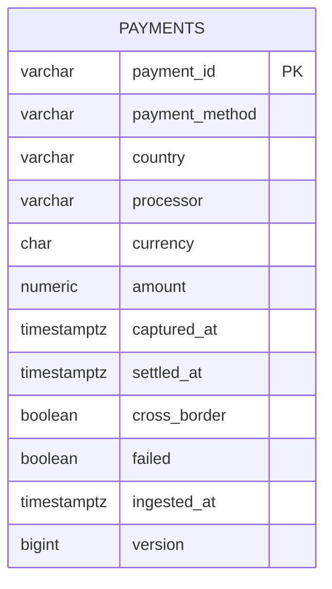

# Settlement Monitoring API — Engineering Design Document

> Audience: senior/staff reviewers. This document explains *why* the system is built the way it is,
> not just what it does. The runnable code lives in `src/`; this is the design of record.

**Contents**

1. [Problem Understanding & Assumptions](#1-problem-understanding--assumptions)
2. [Functional & Non-Functional Requirements](#2-functional--non-functional-requirements)
3. [High-Level Architecture](#3-high-level-architecture)
4. [Detailed Low-Level Design](#4-detailed-low-level-design)
5. [UML Diagrams](#5-uml-diagrams)
6. [Database Design & DDL](#6-database-design--ddl)
7. [API Specifications](#7-api-specifications)
8. [Package Structure](#8-package-structure)
9. [Implementation Walkthrough](#9-implementation-walkthrough)
10. [Concurrency, Reliability & Security](#10-concurrency-reliability--security)
11. [Testing Strategy](#11-testing-strategy)
12. [Deployment & DevOps](#12-deployment--devops)
13. [Trade-offs & Alternative Designs](#13-trade-offs--alternative-designs)
14. [Staff Engineer Review Notes](#14-staff-engineer-review-notes)
15. [Future Enhancements](#15-future-enhancements)

---

## 1. Problem Understanding & Assumptions

OceanTrade processes ~$400M/yr of cross-border B2B payments through Yuno. $23M has been captured
(left the buyer) but not confirmed settled (arrived at the seller), and the team cannot distinguish
payments that are merely mid-flight from payments that are genuinely stuck. The cause is **settlement
timing variability**: each *(payment method × geography)* settles on a different clock (PIX ≈ 1 hour,
Brazil bank transfer ≈ 7 days, cross-border adds days for FX), and there's no system encoding those
expectations.

The deliverable is a backend service that (1) classifies every payment's settlement status against
the *correct* window for its rail and region, (2) aggregates that into actionable analytics, and
(3) optionally detects anomalous degradation.

**The key insight that shapes the whole design:** *settlement status is a function of time*. The same
payment is `PENDING` at 10:00 and `DELAYED` at 18:00 with no event in between. Therefore status is a
**derived/computed value**, not stored state. This single decision drives the architecture
(classification is a pure function of `payment + windows + now`), the persistence model (store facts,
not verdicts), and the test strategy (inject a `Clock`).

### Assumptions

| # | Assumption | Rationale / impact |
|---|---|---|
| A1 | A captured payment is the unit of interest; the `capturedAt` timestamp starts the settlement clock. | Matches the lifecycle (auth → capture → settle). Authorization-only holds aren't tracked here. |
| A2 | `FAILED` is an **input fact** (the processor told us), not something we infer from timing. | You cannot distinguish "lost" from "very late" by clock alone; treating late as failed would be wrong. |
| A3 | "Region" granularity is **country** (ISO-style code). | The dataset is country-level; the config supports finer keys later. |
| A4 | Cross-border surcharge applies as **business days** on top of the base window. | International banking + FX clears on business days. Configurable. |
| A5 | `AT_RISK` threshold = `2 × expected window` (configurable `risk-multiplier`). | Directly from the brief ("2x normal settlement time"). |
| A6 | FX rates are supplied via config and assumed static per run; analytics normalize to USD. | A real system would pull live/daily rates; out of scope, abstracted behind `CurrencyConverter`. |
| A7 | Business-day calendar = Mon–Fri, **no public-holiday calendar** in v1. | Holidays are a per-country data set; pluggable later (see §15). Documented limitation. |
| A8 | Volume for this service is **analytical**, not the money-movement path. | It reads settlement facts; it does not move funds, so it is not in the critical authorization path. |

### Clarifying questions a real engagement would ask (answered here with defaults)

- Are settlement windows defined in business or calendar days per rail? → Configurable per rule (`unit`).
- Is `settledAt` pushed via webhook/reconciliation files, or polled? → Modeled as ingest; see §15 for event-driven.
- Should efficiency count `PENDING` as "on track"? → No; efficiency = on-time settled ÷ settled (clean, defensible).

---

## 2. Functional & Non-Functional Requirements

### Functional

- **F1 Classification** — given a batch of payments, return each with one of
  `PENDING_SETTLEMENT | SETTLED | DELAYED | AT_RISK | FAILED`, time-in-transit, expected window, the
  deadline, and an attention flag.
- **F2 Configurable windows** — expected windows differ per *(method, country)* and are editable
  without code changes; cross-border adds a surcharge.
- **F3 Analytics** — total value by status, avg settlement time by method and by country, worst
  *(method, country)* combos, settlement efficiency rate.
- **F4 Anomaly detection (stretch)** — flag segments degrading vs. their baseline, with severity +
  confidence.
- **F5 Persistence & query** — ingest payments idempotently; query/filter stored payments.

### Non-Functional

| Attribute | Target / approach |
|---|---|
| **Correctness** | Deterministic, unit-tested time math; injected `Clock`; reference generator cross-checks. |
| **Configurability** | `@ConfigurationProperties`; zero-deploy window changes. |
| **Performance** | Classification is O(1) per payment; analytics O(n) single pass per group. Stateless `/classify` scales horizontally. |
| **Scalability** | Stateless app tier → HPA; read-heavy → read replicas / caching (§10, §15). |
| **Reliability** | Idempotent ingest, optimistic locking, transactional boundaries, graceful error envelope. |
| **Observability** | Actuator health/readiness/liveness, Micrometer → Prometheus, structured logs, trace-ready. |
| **Security** | Profile-gated OAuth2 resource server (JWT), scope-based authz, non-root containers, no secrets in code. |
| **Maintainability** | Hexagonal-leaning layering, SOLID, small single-responsibility services, high test coverage. |

---

## 3. High-Level Architecture

A layered / ports-and-adapters arrangement. The **domain logic** (window resolution, classification,
analytics, anomaly detection) has no framework or persistence dependencies and could be lifted into a
library unchanged. Spring MVC and JPA are *adapters* at the edges.



**Why this shape.** The brief's hard part is a *domain* algorithm, not plumbing. Isolating the domain
keeps it independently testable (no Spring context needed for the maths) and swappable at the edges
(H2 → Postgres, REST → gRPC) without touching business rules — Dependency Inversion in practice.

---

## 4. Detailed Low-Level Design

### 4.1 Responsibilities (Single Responsibility Principle)

| Class | Responsibility | Why separate |
|---|---|---|
| `SettlementProperties` | Hold externalized config (windows, surcharge, risk multiplier, FX, anomaly tunables). | Config is data; one place to change behaviour. |
| `SettlementWindowResolver` | Resolve the rule for *(method, country)* and turn it into deadlines (business-day math, surcharge, risk threshold). | All time arithmetic in one cohesive unit; keeps the classifier a clean decision table. |
| `CurrencyConverter` | Normalize amounts to USD. | FX is an independent concern reused by classification + analytics. |
| `SettlementClassificationService` | Apply the decision table to produce an `EnrichedPayment`. | The core engine; pure function of `payment + now`. |
| `AnalyticsService` | Aggregate a list of `EnrichedPayment` into `AnalyticsResponse`. | Pure, stateless, reusable over any population. |
| `AnomalyDetectionService` | Compare recent vs. baseline per segment; score severity/confidence. | Independent, tunable, optional. |
| `PaymentService` | Orchestrate persistence + the domain services; transactional boundaries. | Application layer; keeps controllers thin and domain pure. |
| `*Controller` | HTTP binding, validation, status codes. | Presentation only. |
| `GlobalExceptionHandler` | Map exceptions → `ApiError`. | Cross-cutting; consistent error contract. |

### 4.2 Design patterns used (and why)

- **Strategy (via configuration data)** — the "settlement window strategy" varies per *(method,
  country)*. Rather than a class per rail (`PixStrategy`, `BankTransferStrategy`…), the strategy is a
  **data-driven rule table** resolved at runtime. *Why this over the classic GoF class-per-strategy:*
  the variation is purely parametric (a number + unit), so polymorphic classes would be ceremony with
  no behavioural difference, and ops needs to add rails **without a deploy**. If a rail ever needs
  *behavioural* difference (e.g., a custom holiday calendar), the resolver is the seam to introduce a
  `WindowStrategy` interface — an open extension point (Open/Closed).
- **Builder** — `Payment`, all DTOs (Lombok `@Builder`). Immutable-ish construction, readable tests.
- **Template/Pure-function pipeline** — `classify → analyze/detect` is a unidirectional data pipeline;
  each stage consumes the previous stage's output, enabling isolated testing.
- **Adapter / Ports-and-adapters** — controllers and the JPA repository are adapters around a
  framework-free core.
- **Dependency Injection (constructor)** — every collaborator is final and injected; no field
  injection, no statics → testable and thread-safe.
- **Specification-ish resolution** — most-specific-match rule selection (exact > wildcard > default).

### 4.3 The classification decision table

```
classify(payment, now):
  if payment.failed                      -> FAILED
  elif payment.settledAt != null         -> SETTLED   (withinWindow = settledAt <= deadline)
  elif now <= expectedDeadline           -> PENDING_SETTLEMENT
  elif now <= riskDeadline               -> DELAYED
  else                                   -> AT_RISK

expectedDeadline = addWindow(capturedAt, rule) [+ addBusinessDays(surcharge) if crossBorder]
riskDeadline     = capturedAt + (expectedDeadline - capturedAt) * riskMultiplier
```

`needsAttention = status ∈ {DELAYED, AT_RISK, FAILED}`.

### 4.4 SOLID self-audit

- **S** — each service does one thing (see 4.1).
- **O** — new rails/countries via config (no code); the resolver is the seam for behavioural variance.
- **L** — no inheritance hierarchies to violate; composition throughout.
- **I** — DTOs are narrow; `PaymentRepository` exposes only what's used.
- **D** — domain depends on the `SettlementProperties` abstraction and an injected `Clock`, not on
  Spring/JPA specifics.

---

## 5. UML Diagrams

### 5.1 Class diagram (core)



### 5.2 Sequence — classify a batch



---

## 6. Database Design & DDL

### 6.1 ER diagram



The model is intentionally a **single aggregate** (`Payment`). There are no child tables in v1 because
the domain operation (classification) needs only the payment's own facts; introducing
processor/country dimension tables now would be premature normalization with no query benefit.

### 6.2 Normalization vs. denormalization

- `payment_method`, `country`, `processor`, `currency` are kept as **denormalized codes** on the row,
  not FKs to lookup tables. Rationale: they are low-cardinality, slowly-changing, and every analytics
  query groups by them — a join per aggregation would add cost for no integrity win (the values are
  validated at the edge). If these ever need rich attributes (display names, regional rollups), add
  dimension tables and keep the codes as natural keys.
- Settlement **status is not a column** — see §1; it is derived. Persisting it would require a
  background re-classifier and invite drift/staleness bugs.

### 6.3 Indexing strategy

```sql
CREATE INDEX idx_payment_method          ON payments (payment_method);
CREATE INDEX idx_payment_country         ON payments (country);
CREATE INDEX idx_payment_processor       ON payments (processor);
CREATE INDEX idx_payment_captured_at     ON payments (captured_at);
CREATE INDEX idx_payment_method_country  ON payments (payment_method, country);   -- hottest grouping
CREATE INDEX idx_payment_unsettled       ON payments (captured_at)
    WHERE settled_at IS NULL AND failed = FALSE;                                  -- partial: "in transit"
```

The **partial index** is the important one operationally: "what's still in transit?" is the dominant
query and touches a shrinking subset of the table, so indexing only unsettled rows keeps it small and
hot as historical settled volume grows unbounded. Full DDL: `src/main/resources/db/schema.sql`.

### 6.4 Transaction boundaries & concurrency

- Ingest is `@Transactional` (write); reads are `@Transactional(readOnly = true)`.
- `@Version` on `Payment` gives **optimistic locking** — concurrent updates to the same `paymentId`
  (e.g., two reconciliation files) fail fast with `OptimisticLockException` rather than silently
  losing the later write. Optimistic is correct here because contention on a single payment is rare;
  pessimistic row locks would add latency for the common no-contention case (see §10).

---

## 7. API Specifications

OpenAPI is served live at `/v3/api-docs` (Swagger UI at `/swagger-ui.html`). Summary contracts:

### `POST /api/v1/settlement/classify` — stateless classification

Request:

```json
{
  "payments": [
    {
      "paymentId": "p-1",
      "paymentMethod": "bank_transfer",
      "country": "BR",
      "processor": "ebanx",
      "currency": "BRL",
      "amount": 12000.00,
      "capturedAt": "2026-06-01T10:00:00Z",
      "settledAt": null,
      "crossBorder": true,
      "failed": false
    }
  ]
}
```

Validation: `paymentMethod`, `country`, `currency`, `amount` (>0), `capturedAt` are required;
`payments` non-empty. Violations → `400` with field-level messages.

Response `200`: array of `EnrichedPayment` (see §5.1 + README §2.1).

### `POST /api/v1/settlement/payments` — ingest (idempotent on `paymentId`) → `201`.
### `GET  /api/v1/settlement/payments?status=&method=&country=&processor=` → filtered list.
### `GET  /api/v1/settlement/payments/{id}` → one, or `404`.
### `GET  /api/v1/analytics/settlement` → `AnalyticsResponse`.
### `GET  /api/v1/analytics/anomalies` → `Anomaly[]`.

### Error envelope (RFC-7807-ish)

```json
{
  "timestamp": "2026-06-07T12:00:00Z",
  "status": 400,
  "error": "Bad Request",
  "message": "Validation failed",
  "path": "/api/v1/settlement/classify",
  "fieldErrors": { "payments[0].amount": "amount must be > 0" }
}
```

### Versioning strategy

**URI versioning** (`/api/v1`). Chosen over header/content negotiation for payment APIs because it is
explicit, trivially routable at the gateway, and obvious in logs and partner integrations. Breaking
changes ship under `/api/v2` with `v1` maintained through a deprecation window.

### Idempotency

`paymentId` is the natural idempotency key for ingest — re-posting the same id upserts rather than
duplicating. For non-naturally-idempotent operations a dedicated `Idempotency-Key` header backed by a
short-TTL store is the standard pattern (see §15); documented as the forward path.

---

## 8. Package Structure

Layered with a framework-free domain core (see README §7 for the tree). Boundaries enforced by
package and dependency direction: `controller → service(application) → service(domain) → repository`,
with `dto`/`model`/`config`/`exception` as supporting packages. Domain services never import
`jakarta.servlet`, controllers never import `jakarta.persistence` — keeping the dependency arrows
pointing inward (Clean Architecture).

---

## 9. Implementation Walkthrough

Built incrementally; each component below maps to a real file under `src/main/java`.

1. **Config (`SettlementProperties`)** — *why first:* everything downstream reads windows/FX from it.
   Bound via `@ConfigurationProperties("settlement")`. *Extensibility:* add a `holidays` map or a
   per-rule `strategy` field without touching consumers.
2. **Enums (`SettlementStatus`, `WindowUnit`)** — closed sets modeled as enums for exhaustiveness and
   safe `switch`. `WindowUnit` (not `java.util.concurrent.TimeUnit`) avoids semantic confusion and
   adds `BUSINESS_DAYS`.
3. **`SettlementWindowResolver`** — the time engine. Resolves most-specific rule, computes deadlines.
   *Alternative considered:* `Duration`-only math — rejected because business-day windows depend on
   the capture weekday, which a fixed `Duration` can't express; we compute a concrete deadline then
   derive the risk threshold by scaling the realized duration.
4. **`CurrencyConverter`** — isolates FX; unknown currency falls back to 1:1 (and is a log-worthy
   event in prod) so analytics never silently drop value.
5. **`SettlementClassificationService`** — the decision table (4.3). Takes an injected `Clock`.
   Produces `EnrichedPayment` with the human `reason` and `expectedWindow` string for UX.
6. **`AnalyticsService`** — pure aggregation: status buckets, in-transit/needs-attention sums,
   per-method/country averages, efficiency, worst combos. Single pass per grouping; no DB coupling.
7. **`AnomalyDetectionService`** — recent-vs-baseline change detection with severity + confidence
   (see §13 for why a heuristic over ML).
8. **`PaymentService`** — application orchestration + transactions; the only stateful service.
9. **Controllers + `GlobalExceptionHandler`** — thin HTTP layer, validation, consistent errors.
10. **`SeedDataLoader`** — dev convenience; loads the demo dataset so GET endpoints have data.

Representative core (classification):

```java
if (p.isFailed()) {
  status = FAILED;
} else if (p.getSettledAt() != null) {
  status = SETTLED;
  withinWindow = !p.getSettledAt().isAfter(deadline);
} else if (!now.isAfter(deadline)) {
  status = PENDING_SETTLEMENT;
} else if (!now.isAfter(riskDeadline)) {
  status = DELAYED;
} else {
  status = AT_RISK;
}
```

---

## 10. Concurrency, Reliability & Security

### Concurrency & thread-safety

- All domain services are **stateless singletons** with only final, injected collaborators → inherently
  thread-safe; no shared mutable state, no synchronization needed.
- **Optimistic locking** (`@Version`) handles concurrent writes to the same payment. Chosen over
  pessimistic (`SELECT … FOR UPDATE`) because same-row contention is rare in settlement ingest;
  optimistic avoids holding DB locks across the request and degrades gracefully (retry on conflict).
  Pessimistic would be the right call only for hot single-row counters, which we don't have.
- **Duplicate requests** are absorbed by the `paymentId` natural key (idempotent upsert).
- **High throughput:** the stateless tier scales horizontally behind the HPA; classification is
  CPU-cheap and allocation-light. Analytics is O(n); for very large books it moves to pre-aggregated,
  cached rollups (§15) rather than scanning per request.

### Reliability & resilience

- Transactional boundaries keep ingest atomic; read-only tx for queries.
- `resilience4j` is on the classpath for the outbound direction (when this service later calls
  processor/FX APIs): **circuit breaker + retry with backoff + timeout** around those clients to fail
  fast and avoid cascading latency. Internal classification needs none of this (no I/O).
- **Eventual consistency:** settlement facts arrive asynchronously (reconciliation/webhooks). The
  derive-on-read model embraces this — there is no status to keep in sync; the latest known
  `settledAt` always yields the correct status at read time.
- Consistent error envelope + correct status codes so clients can react deterministically.

### Security (OWASP-aligned)

- **AuthN/AuthZ:** profile-gated OAuth2 **resource server** validating JWTs; issuance delegated to an
  IdP (Auth0/Cognito/Keycloak). Scope-based authorization — `SCOPE_settlement.read` for GETs,
  `SCOPE_settlement.write` for ingest. Stateless sessions.
- **Why resource server, not custom JWT parsing:** key rotation, JWKS, expiry, and algorithm
  confusion are exactly the bugs teams get wrong; Spring's resource server gives OWASP-aligned
  defaults for free.
- **Transport:** TLS terminated at the gateway/ingress; HSTS.
- **Data handling:** no PAN/PII stored — only payment metadata and amounts; FX/secrets via env, never
  committed. Containers run **non-root, read-only root filesystem, dropped capabilities**.
- **Input validation** at the boundary (`@Valid`) mitigates injection/oversized payloads; JPA
  parameter binding prevents SQL injection.
- **Least privilege** DB user; secrets via K8s secrets / external secrets manager.

### Observability

- **Health/readiness/liveness** via Actuator (wired to K8s probes).
- **Metrics** via Micrometer → Prometheus (`/actuator/prometheus`), tagged `application`.
  Domain metrics to add: counter of classifications by status, gauge of in-transit USD, histogram of
  time-in-transit — these become the dashboard.
- **Tracing:** Micrometer Tracing / OpenTelemetry-ready; propagate trace ids across ingest → DB.
- **Logging:** structured (JSON in prod), correlation id per request; no sensitive data in logs.
- **Alerting:** page on readiness failures, error-rate SLO burn, and (domain) a spike in
  `AT_RISK` value or any HIGH-severity anomaly.

---

## 11. Testing Strategy

| Layer | What | Tooling |
|---|---|---|
| **Unit — time math** | `SettlementWindowResolverTest`: rule precedence, business-day skipping, surcharge, risk threshold (exact dates). | JUnit 5 + AssertJ |
| **Unit — engine** | `SettlementClassificationServiceTest`: every status branch with a frozen clock. | JUnit 5 |
| **Unit — analytics** | `AnalyticsServiceTest`: value-by-status, in-transit, efficiency, avg times, worst combo. | JUnit 5 |
| **Unit — anomaly** | `AnomalyDetectionServiceTest`: slowdown detected; stable segment not flagged. | JUnit 5 |
| **Web slice** | `SettlementControllerTest`: happy path + 400 on empty/invalid body (`@WebMvcTest`, mocked services). | MockMvc + Mockito |
| **Integration** | `SettlementMonitoringApplicationTests`: full context boots, seeds, health + analytics respond. | `@SpringBootTest` |

**Coverage strategy:** exhaustive on the *decision table and time math* (the risk lives there), smoke
on wiring. Determinism comes from the injected `Clock` and fixed timestamps — no flaky `now()`.
The **Python generator doubles as a reference oracle**: it independently reproduces the window math
and reclassifies its own output, cross-checking the Java logic.

**Beyond v1:** contract testing (Spring Cloud Contract / Pact) against the dashboard consumer;
performance testing (Gatling/k6) on `/analytics` at book size; mutation testing (PIT) to validate the
test suite's strength on the classifier.

---

## 12. Deployment & DevOps

- **Docker:** multi-stage build (JDK 21 build → JRE 21 runtime), non-root user, container
  `HEALTHCHECK`, `MaxRAMPercentage` for container-aware heap. `.dockerignore` keeps the context lean.
- **docker-compose:** API + PostgreSQL with a DB healthcheck gate and schema bootstrap.
- **Kubernetes:** `Deployment` (3 replicas, rolling, readiness/liveness probes, resource
  requests/limits, hardened `securityContext`), `Service`, `ConfigMap`, `Secret` (stubbed; real
  secrets via External Secrets Operator), and an `HPA` (CPU 70%, 3–12 replicas).
- **CI (GitHub Actions):** JDK 21 → `./gradlew clean build` (compile + test) → Docker image build;
  Spotless reported non-blocking. Gates merges to `master`.
- **Config & secrets:** 12-factor — everything environment-driven; `application-prod.yml` reads
  `DB_URL`, `DB_USER`, `DB_PASSWORD`, `OAUTH_ISSUER_URI`; nothing sensitive in git.
- **Schema management:** prod runs `ddl-auto=validate`; migrations owned by Flyway/Liquibase (the
  committed `schema.sql` is the v1 baseline).

---

## 13. Trade-offs & Alternative Designs

| Decision | Chosen | Alternative | Why |
|---|---|---|---|
| Status storage | Derive on read | Persist + background updater | Status is a function of time; persisting invites staleness and a whole reconciler. Derive-on-read is simpler and always correct. |
| Window strategy | Data-driven config table | Class-per-rail Strategy | Variation is parametric; classes would be ceremony and require deploys to add rails. Resolver remains the seam for behavioural variance. |
| Business-day math | Compute concrete deadline, scale duration for risk | Pure `Duration` arithmetic | Business-day windows depend on capture weekday; a fixed `Duration` can't model weekends. |
| Locking | Optimistic (`@Version`) | Pessimistic row locks | Same-row contention is rare; optimistic avoids lock latency on the common path. |
| Anomaly detection | Explainable recent-vs-baseline heuristic + confidence | ML model (e.g., isolation forest / EWMA control chart) | Must be explainable to finance, cheap, and need no training pipeline. Heuristic is a strong v1; the interface allows swapping in a model later. |
| Analytics | On-demand single pass | Materialized rollups / OLAP | At challenge scale O(n) is fine and always fresh; rollups/caching are the documented scale path. |
| FX | Config table | Live FX service | Out of scope; abstracted behind `CurrencyConverter` so a live adapter drops in. |
| Persistence | JPA + H2/Postgres | jOOQ / raw SQL | JPA is idiomatic for this CRUD-shaped store; the repository interface hides the choice. |

---

## 14. Staff Engineer Review Notes

**What would get this *rejected* at a payments-grade review — and is avoided here:**

- Storing settlement status as a column and letting it drift. → Derived on read.
- `double`/`float` for money. → `BigDecimal` end-to-end with explicit scale + `HALF_UP`.
- `Instant.now()` sprinkled through business logic. → A single injected `Clock`; deterministic tests.
- Field injection and stateful singletons. → Constructor injection, stateless services.
- Business rules hardcoded in `if` ladders by country. → Externalized, precedence-resolved config.
- Swallowed exceptions / inconsistent error shapes. → One `@RestControllerAdvice`, typed envelope.
- Naive business-day math (treating "3 days" as 72h). → Weekend-aware deadline computation.
- Leaking entities as API contracts. → Separate `dto` layer; entities never serialized directly.
- Security as an afterthought / secrets in code. → Profile-gated JWT, env-driven secrets, non-root.

**What makes this *staff*-level rather than mid-level:**

- The **derive-on-read insight** and its consistent propagation through model, API, and tests.
- A **configurability design** that meets the requirement with *data and a precedence rule*, plus a
  named seam (the resolver) for future behavioural variance — extension without modification.
- Explicit **trade-off reasoning** (optimistic vs. pessimistic, heuristic vs. ML, config vs. classes)
  rather than defaulting.
- The **test oracle**: an independent reference implementation cross-checking the engine, not just
  asserting the code agrees with itself.
- Clear **layering/dependency direction** so the domain is portable off Spring.

---

## 15. Future Enhancements

- **Holiday calendars** per country (pluggable `BusinessCalendar`) — the one acknowledged gap in the
  business-day math.
- **Event-driven settlement updates** — consume processor webhooks / reconciliation files via a
  message broker (Kafka) for near-real-time `settledAt` updates and exactly-once via the idempotency
  key + outbox pattern.
- **Idempotency-Key header** + short-TTL store for non-naturally-idempotent operations.
- **Materialized analytics** — incremental rollups (or a read-optimized store) + caching for
  book-scale dashboards; `/analytics` then serves cached aggregates with a freshness SLA.
- **Live FX** adapter behind `CurrencyConverter`, with as-of-capture rate snapshotting for auditable
  USD figures.
- **Anomaly v2** — EWMA control charts / seasonal baselines per segment; processor-level rollups;
  feed HIGH-severity anomalies to alerting.
- **Domain metrics & dashboards** — Grafana board for in-transit USD, AT_RISK value, efficiency by
  corridor; SLOs on classification freshness.
- **Multi-tenancy** — partition by merchant for a true platform offering.
```
